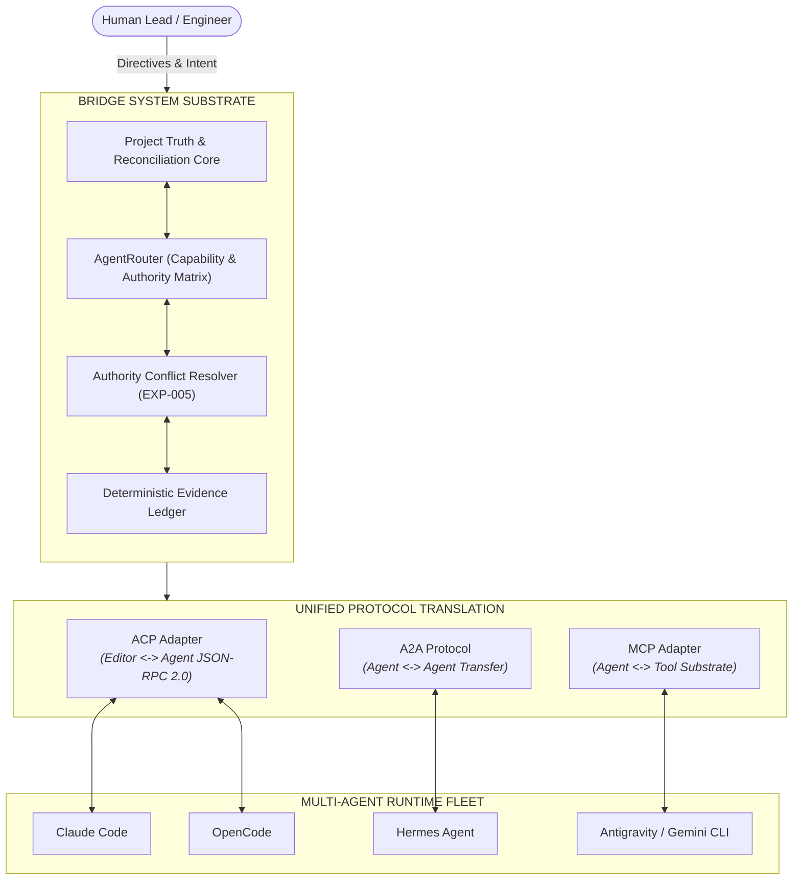

<div align="center">
 

 <h1>Bridge</h1>

 <p>
 <strong>The epistemological boundary and orchestration substrate between AI agents.</strong>
 </p>

  <p>
    <a href="https://github.com/aryankori/bridge/actions/workflows/ci.yml"></a>
    <a href="https://gitlab.com/aryankori/bridge/-/pipelines"></a>
    <a href="https://bridge-rho-wine.vercel.app"></a>
    <a href="LICENSE"></a>
    <a href="https://nodejs.org/"></a>
    <a href="https://www.typescriptlang.org/"></a>
    <a href="https://vitest.dev/"></a>
    
  </p>
</div>

---

[[_TOC_]]

---

## 1. Vision & Executive Summary

Bridge sits between the software engineer and heterogeneous AI coding agents. Instead of engineers constantly context-switching between Claude Code, OpenCode, Hermes, and Antigravity, Bridge establishes a unified system substrate that can **discover, launch, monitor, arbitrate, and mathematically govern** all of them.

Bridge is **not** a chat UI or wrapper around LLM APIs. It is a systems-level interoperability layer that interfaces with each agent's native protocol and preserves formal **Project Truth**.



---

## 2. The Thesis: Project Truth vs. Vector Memory

Current agentic tools rely heavily on naive vector "memory", which systematically leads to context pollution:
- Vector indices store hallucinations, dead ends, and superseded code paths alongside valid architecture.
- When multiple autonomous agents edit a repository simultaneously, context drift leads to semantic collisions and conflicting implementations.

Bridge replaces unstructured probabilistic memory with **Project Truth**:
- **Deterministic State Reconciliation:** Code, architectural invariants, and test evidence form the canonical ground truth.
- **Authority Matrix:** Explicit decision boundaries determine which agent or human holds decisive veto power over specific code paths and specifications.
- **Formal Transfer Proofs:** Cross-agent handoffs are governed through strongly typed transfer schemas (`ExperimentalWorkTransfer`).

Foundational research documents:
- [The Bridge Thesis v2](docs/research/bridge-thesis-v2.md)
- [Pre-Architecture Decision Memo](docs/research/bridge-prearchitecture-decision-memo.md)
- [EXP-005 Post-Pilot Review](docs/research/exp-005-post-pilot-review.md)

---

## 3. Current Milestones & Empirical Status

### Phase 0: Reconnaissance & Foundation (Completed)
- Mapped process topologies, session storage, and communication protocols for primary coding agents (Claude Code, OpenCode, Hermes).
- Selected **ACP (Agent Client Protocol)** as the lowest-common-denominator editor substrate.
- Implemented core type system, event bus, `WorkTransfer` primitive, and `AgentRouter` (`62f47e5`).

### Phase 1: Empirical Conflict Resolution Benchmark (Active)
- **Benchmark `EXP-005`**: 10-scenario cross-agent behavior benchmark testing conflict detection across Unambiguous, Ambiguous, and Unsolvable conditions.
- **Pre-Verification Result**: The frozen resolver (`fc322c6`) agrees with the project-authored gold labels on **10/10** scenarios. The project team wrote these labels, so this result is agreement, not independent accuracy. Two labels do not agree with their own scenario tier: `exp005-scn-001` (tier Unambiguous, gold `AMBIGUOUS`) and `exp005-scn-009` (tier Unsolvable, gold `PERMITTED`).
- **Live Agent Pilot**: 25 of 60 planned trials have a scored record. The automated scorer has known defects. The pilot result is inconclusive. Refer to `paper/sections/06_results.tex`.
- **Developer Wedge**: `bridge resolve` arbitrates a divergence between two agent worktrees against CODEOWNERS and commit signatures (see below).

### `bridge resolve`

```bash
pnpm build
node dist/bin/bridge.js resolve ../worktree-agent-a ../worktree-agent-b
node dist/bin/bridge.js resolve agent-a agent-b --json --identities identities.json --trusted main
```

For each file that both sides change, Bridge reads CODEOWNERS (at the merge base, or at the `--trusted` ref) and finds, on each side, the newest commit that produced the tip version of the file. A side has owner standing only when that commit has a good signature (`%G?` = `G`) and the signer (`%GS`) is an owner. An owner author email alone is not enough, because anyone can set it. `--allow-unsigned` also accepts owner-authored commits without an owner signature. Bridge compares committed work only; uncommitted changes in a worktree are not part of the plan.

Use `--trusted main` when agent branches may share commits that are not on your protected branch. Bridge then reads CODEOWNERS from `main` and blocks the plan when the merge base is not on `main`. Criss-cross histories with more than one merge base are refused (exit 1).

| Status | Condition | Exit code |
| :--- | :--- | :--- |
| `PERMITTED` | No file changes on both sides, or both sides produce the same content | 0 |
| `PERMITTED_WITH_OVERRIDE` | Only one side has owner standing; that side governs | 0 |
| `AMBIGUOUS` | Both sides have owner standing, or no rule assigns an owner | 2 |
| `BLOCKED_CONFLICT` | Neither side has owner standing, a signature is bad (`B`) or made by a revoked key (`R`), a branch changes CODEOWNERS, or the merge base is not on the `--trusted` ref | 3 |

---

## 4. Protocol Stack Architecture

| Layer | Protocol | Wire Format | Functional Boundary |
| :--- | :--- | :--- | :--- |
| **ACP** | Agent Client Protocol | JSON-RPC 2.0 over stdio/HTTP | Client/IDE <-> Agent command execution |
| **MCP** | Model Context Protocol | JSON-RPC 2.0 over stdio | Agent <-> Specialized external tools |
| **A2A** | Agent-to-Agent Transfer | HTTP + JSON-RPC + SSE | Asynchronous task transfer between peer agents |

---

## 5. Development & Local Setup

### Prerequisites
- Node.js >= 20.0.0
- [pnpm](https://pnpm.io/) (`corepack enable && corepack prepare pnpm@latest --activate`)

### Installation
```bash
# Clone and install dependencies
git clone https://gitlab.com/aryankori/bridge.git
cd bridge
pnpm install
```

### Build & Quality Verification
| Command | Action |
| :--- | :--- |
| `pnpm typecheck` | Validates TypeScript compiler strictness |
| `pnpm test` | Executes unit test suite via Vitest |
| `pnpm test:coverage` | Runs the suite with V8 coverage; enforces 100% on the `bridge resolve` modules |
| `pnpm build` | Bundles TypeScript source via tsup |
| `pnpm lint` | Runs ESLint analysis |
| `pnpm format` | Formats codebase with Prettier |
| `pnpm experiment:validate` | Validates empirical research schemas and offline fixtures |

---

## 6. Continuous Verification (CI/CD)

> **Deterministic CI Guarantee:** Automated pipelines (GitLab CI / GitHub Actions) strictly run deterministic static checks, TypeScript typechecking, and offline unit tests. Outbound LLM API calls and non-deterministic agent runs are strictly segregated to local research harnesses (`pnpm experiment:pilot`).

---

## 7. Core Architectural Invariants

1. **Evidence Before Abstraction:** Architectural decisions are grounded in empirically observed agent failure modes rather than speculative frameworks.
2. **Strict Agent Agnosticism:** Core orchestration logic knows nothing of specific vendor models; new agents integrate solely through standardized protocol adapters.
3. **Defense-in-Depth Process Isolation:** Agents execute in isolated worktrees with gated tool authority.
