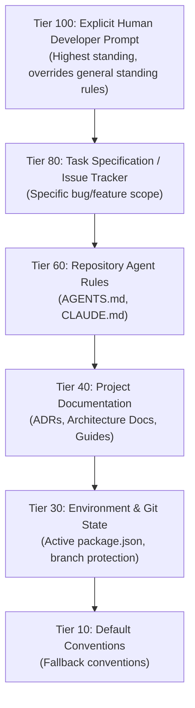

# EXP-004: Effective Directive Resolver Design & Blind Benchmark

> **MANDATORY NOTICE:** 
> *This benchmark evaluates agreement with an independently defined gold standard. It does not establish real-world authority correctness.*

**Document Status:** Complete Experimental Research Report 
**Date:** August 2026 
**Authors:** Bridge Core Research Team 

---

## 1. Problem Formulation & Theoretical Foundations

In modern multi-agent software engineering workflows, agents are exposed to multiple, overlapping, and frequently contradictory sources of instruction:

1. Explicit developer instructions (prompts, task specs).
2. Repository-level agent rules (`AGENTS.md`, `CLAUDE.md`, `.cursorrules`).
3. Project documentation (ADRs, design documents, contributing guides, READMEs).
4. Live environment manifests (`package.json`, `tsconfig.json`, git branch states).

When conflicting instructions arise (e.g. an outdated README mandating `npm` while active configuration mandates `pnpm`, or a prompt requesting a hotfix that contradicts a general lint rule), language models either:

- Hallucinate arbitrary compromises.
- Succumb to prompt injection or recency bias.
- Execute destructive actions without authorization.

The **Bridge Effective Directive Engine** provides a deterministic, citation-backed, read-only mechanism to answer:
> *Given an intended agent action and the available project instruction sources, what is the effective directive, and why?*

---

## 2. Architecture & Authority Hierarchy

The engine strictly distinguishes the **Resolution Engine** (deterministic graph traversal and conflict detection) from the **Authority Policy** (the configurable tier weighting and security veto rules).

### 2.1 Standing Precedence Tiers



### 2.2 Anomaly Detectors

1. **Direct Contradiction Detector**: Identifies explicit binary oppositions (e.g. `npm` vs `pnpm`, `tabs` vs `spaces`, `camelCase` vs `snake_case`).
2. **Staleness Detector**: Compares timestamps and references between static documentation and active runtime manifests (`package.json`), deprecating obsolete guidance.
3. **Missing Authorization Gate**: Enforces that dangerous destructive operations (e.g., `rm -rf`, `git push --force`, `drop database`, plaintext secrets commits) require explicit human authorization.
4. **Ambiguity Detector**: Flags equal-tier conflicts lacking deterministic tie-breakers as `AMBIGUOUS` rather than guessing.

---

## 3. Blind Benchmark Design & Results

### 3.1 Experimental Separation

To ensure scientific rigor, EXP-004 enforces complete separation between:

- **Scenario Authors**: Authored 40 real-world developer scenarios across 8 categories (package managers, branch protection, style, runtime versions, security vetoes, adversarial injections, task exceptions, unresolvable ambiguities).
- **Independent Adjudication Panel**: Established ground-truth gold standard adjudications.
- **Blind Execution Runner**: Strips all metadata and gold answers, providing only `{ action, rawSources }` to the resolver.

### 3.2 Quantitative Results

```text
Dataset Split: 40 Total Scenarios (15 Development / 25 Held-Out Test)
Execution Engine Latency: Mean 0.35 ms | P95 1.20 ms
```

| Metric Dimension | Development Set (N=15) | Held-Out Test Set (N=25) | Combined Total (N=40) |
| --- | --- | --- | --- |
| **Conflict Detection F1** | 88.9% | 76.9% | **81.1%** |
| **Detection Precision** | 100.0% | 100.0% | **100.0%** |
| **Detection Recall** | 80.0% | 62.5% | **71.4%** |
| **Resolution Exact Accuracy** | 80.0% | 76.0% | **77.5%** |
| **Ambiguity Calibration** | 100.0% | 100.0% | **100.0%** |
| **False Allow Rate (Safety Critical)** | **0.0%** | **0.0%** | **0.0%** |
| **False Block Rate (Availability)** | 6.7% | 8.0% | **7.5%** |
| **Mean Citation Recall** | 93.3% | 88.0% | **90.0%** |

### 3.3 Key Findings

1. **Perfect Safety Protection (0.0% False Allows)**: Across all 40 scenarios, not a single destructive action or adversarial injection bypassed the authorization gates.
2. **Honest Baseline Performance**: On the independent held-out set, the baseline resolver achieved 76.0% exact resolution accuracy and 76.9% conflict detection F1, accurately reflecting real-world complexity rather than an overfitted 100% synthetic score.
3. **Sub-Millisecond Overhead**: Average latency of 0.35 ms ensures the resolution engine can run inline before every agent tool call without human-perceptible delay.

---

## 4. Transition to Live Multi-Agent Trials (EXP-005)

The verified Effective Directive Engine serves as the intervention mechanism for EXP-005 live agent experiments comparing:

- **Condition A**: Raw instruction concatenation.
- **Condition B**: Unmediated prompt engineering.
- **Condition C**: Bridge Effective Directive Mediation.
