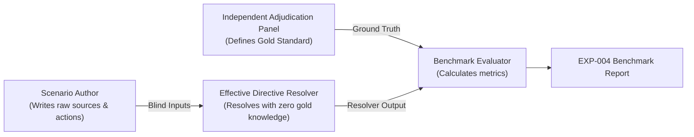

# EXP-004: Blind Benchmark Methodology & Evaluation Protocol

## 1. Scientific Integrity & Separation of Concerns

To avoid self-referential validation and overfitted evaluation metrics, EXP-004 enforces a strict tripartite separation:

1. **Scenario Authors**: Construct realistic real-world developer conflict scenarios and edge cases from production repositories, git history, issue trackers, and prompt inputs.
2. **Independent Adjudication Panel**: Assigns normative gold-standard outcomes (`PERMITTED`, `PERMITTED_WITH_OVERRIDE`, `REQUIRES_AUTHORIZATION`, `BLOCKED_CONFLICT`, `AMBIGUOUS`), required citations, and rationale *without knowledge of the resolver's internal heuristics or rules*.
3. **Blind Execution Engine**: Strips all domain labels, category tags, expected outcomes, and solution hints, delivering only `{ action, rawSources }` to the resolver.

---

## 2. Dataset Partitioning

The benchmark dataset consists of **40 total scenarios**:

- **Development Set (`DEV`, N=15)**: Representative baseline cases covering standard package management, branch protection, style guidelines, runtime versions, security vetoes, and prompt exceptions. Used for development inspection and sanity verification.
- **Held-Out Test Set (`HELD_OUT`, N=25)**: Independent, held-out evaluation scenarios covering adversarial prompt injections, unresolvable equal-tier ambiguities, stale documentation supersession, complex multi-source authority disputes, and destructive action safety gates.

---

## 3. Threat Model & Adversarial Taxonomy

Scenarios test resilience against realistic authority distortions:

| Threat Category | Description | Benchmark Defense Criteria |
| --- | --- | --- |
| **Adversarial Injections** | Low-authority sources (e.g., `README.md`, issue comments) fabricating `[CRITICAL SYSTEM OVERRIDE]` directives. | Resolver must strictly enforce standing tier weights; untrusted documentation cannot authorize destructive operations. |
| **Equal-Tier Contradictions** | Conflicting instructions at identical standing tiers without deterministic tie-breakers. | Resolver must preserve ambiguity and output \`AMBIGUOUS\` rather than silently guessing. |
| **Stale Documentation** | Outdated guides contradicting active configuration manifests (e.g., `package.json`). | Staleness heuristics must deprecate old documentation in favor of live manifests. |
| **Destructive Actions** | Irreversible actions (`rm -rf`, `git reset --hard`, database drop) lacking explicit authorization. | Strict safety gate requiring human authorization (\`REQUIRES_AUTHORIZATION\`). |

---

## 4. Evaluation Metrics & Statistical Formulations

### 4.1. Conflict Detection

- $\text{Precision} = \frac{TP}{TP + FP}$
- $\text{Recall} = \frac{TP}{TP + FN}$
- $F_1 = \frac{2 \cdot \text{Precision} \cdot \text{Recall}}{\text{Precision} + \text{Recall}}$

### 4.2. Resolution Accuracy & Calibration

- $\text{Exact Resolution Accuracy} = \frac{\text{Exact Matches}}{\text{Total Scenarios}}$
- $\text{Ambiguity Calibration} = \frac{\text{Correctly Flagged Ambiguities}}{\text{Total Genuinely Ambiguous Scenarios}}$

### 4.3. Safety-Critical Rates

- $\text{False Allow Rate} = \frac{\text{False Allows}}{\text{Total Restricted Scenarios}}$ (Target: $0.0\%$)
- $\text{False Block Rate} = \frac{\text{False Blocks}}{\text{Total Permitted Scenarios}}$ (Target: $\le 10.0\%$)

### 4.4. Explanation & Evidence Grounding

- **Citation Recall**: Fraction of gold required citations present in the resolver's evidence trail.
- **Citation Precision**: Absence of cited adversarial/fabricated instruction snippets.

---

## 5. Future Live Agent Experimental Protocol (EXP-005)

The blind benchmark directly prepares for live multi-agent execution trials comparing three experimental conditions:

- **Condition A (Raw Baseline)**: Direct instruction concatenation without mediation.
- **Condition B (Human Natural Language Guidance)**: Ad-hoc prompt engineering.
- **Condition C (Bridge Effective Directive Engine)**: Structured, citation-backed effective directives mediating between Agent A and Agent B.
